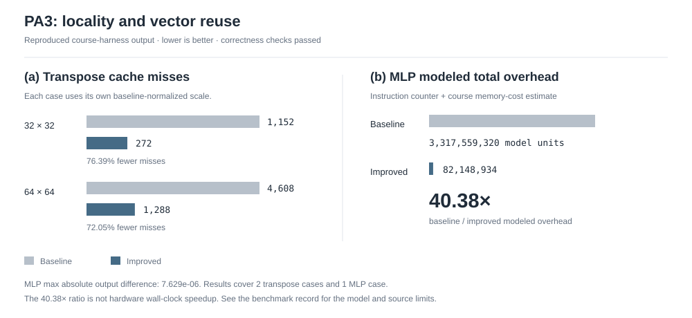

# Cache simulation and RISC-V vector matrix computation

Three NCKU computer-organization exercises: track cache accesses with pseudo-LRU replacement, reduce transpose misses with cache-aware blocking, and vectorize matrix multiplication used in MLP inference. The vector implementation processes four output rows together to reuse loaded values from matrix B.

`C` · `C++` · `PLRU` · `RISC-V Vector` · `Spike`

[Results](#results-and-implementation-at-a-glance) · [Vector kernel](#how-the-vector-kernel-works) · [Implementation notes](docs/implementation.md) · [Run](#run-the-remaining-parts) · [Benchmark record](docs/benchmarks/README.md)

## Results and implementation at a glance

| Part | What this snapshot implements | Available evidence |
| --- | --- | --- |
| Cache simulation | Tree-based PLRU, valid/dirty tags, hit/miss and write-back accounting | Course judge: **3 PASS, 0 WA, 0 ERR** |
| Matrix transpose | 8 × 8 blocking, diagonal-tile handling, and 4 × 4 staging within off-diagonal 64 × 64 tiles | 32 × 32 misses **1,152 to 272**; 64 × 64 misses **4,608 to 1,288**, both outputs passed |
| MLP matrix multiplication | RVV floating-point multiply-accumulate, four-row blocking, and tail handling | **40.38× baseline/improved modeled total overhead**, output passed; maximum absolute difference `7.629e-06` |



All three parts were checked on **2026-09-29** in an isolated copy inside the course container, `asrlab/comp-org:pa3`. The transpose and MLP values match the author's [archived terminal record](docs/benchmarks/pa3-reported-run.txt). The [benchmark notes](docs/benchmarks/README.md) record the environment, commands, source fingerprints, and scope.

The **40.38×** ratio compares instruction-counter values plus an assumed memory cost from the course judge. It is not a hardware wall-clock speedup. The result covers one MLP case; the transpose comparison covers the two matrix sizes shown above.

## How the vector kernel works


[matmul_improved.c](3_mlp/matmul_improved.c) uses RVV `e32m4` vectors. Processing four rows together reuses each loaded B vector across four accumulators, rather than treating each row as a separate pass. The code also handles rows left over after the four-row groups.

The inner reduction loop loads a contiguous slice of B once for four output rows:

```c
for(int k=0;k<K;k++){
    b=LOAD(B+k*N+y,vl);
    v0=FAM(v0,a0[k],b,vl), v1 = FAM(v1, a1[k], b, vl);
    v2 = FAM(v2, a2[k], b, vl), v3 = FAM(v3, a3[k], b, vl);
}
```

`FAM` wraps RVV vector-scalar fused multiply-accumulate. Each accumulator holds one output row's current column slice until the K loop finishes. `VL(N-y)` chooses the active vector length; advancing by `vl` handles the final column slice without assuming a fixed vector width.

The implementation exercises memory-locality reasoning, register reuse, and vector tail handling. The [implementation notes](docs/implementation.md) trace these choices, the transpose staging, and the PLRU tree back to the source. The recorded improvement combines those design choices with the compiler and course cost model; no ablation isolates an individual optimization's contribution.

The assignment's [judge](3_mlp/judge.py) compares MLP output with the [scalar baseline](3_mlp/matmul_naive.c), then scores simulator-derived overhead. The recorded comparison covers one MLP input case, not a range of model sizes.

## Cache simulator

[cachesim.cc](1_cachesim/cachesim.cc) reads cache configurations and memory-access traces. A PLRU tree chooses replacement candidates within each set; valid and dirty state determine misses and write-back behavior.

On Linux with `g++`, `make`, Python 3, and Git:

```bash
cd 1_cachesim
make all
python3 judge.py 'input/*.in'
```

Read the judge's PASS, WA, and ERR summary. Its exit status alone does not reliably indicate that every case passed.

## Run the remaining parts

The [transpose implementation](2_transpose/snippet.c) works in 8 × 8 tiles. Diagonal tiles transpose staged values in place; off-diagonal 64 × 64 tiles use 4 × 4 staging to reduce conflict misses. This implementation targets the assignment's 32 × 32 and 64 × 64 cases, not arbitrary matrix sizes.

The harness needs Linux, GCC, Python 3, Git, and Valgrind with Lackey:

```bash
cd 2_transpose
make all
make judge-all
```

The MLP harness needs the course RISC-V environment: `riscv64-unknown-linux-gnu-gcc`, Spike, and the `RISCV` environment variable. It does not run as a normal x86 executable. The course container image is `asrlab/comp-org:pa3`.

```bash
# Inside the configured course RISC-V environment
cd 3_mlp
make judge-all
```

## Coursework scope

Each part retains its course Makefile and test harness. Test traces, answer files, and MLP inputs are provided course materials, not independently authored datasets. Student implementations and the framework coexist in this snapshot. No official assignment score is claimed.
