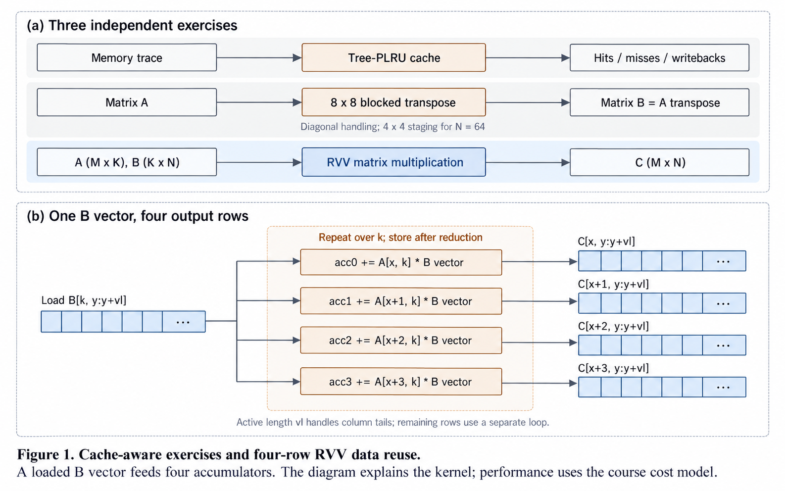

# PA3 method figure

[Project overview](../README.md) · [Implementation notes](implementation.md) · [Generation prompt](prompts/method-overview.txt)

The upper panel contains three independent assignments, not stages of one application: [PLRU cache simulation](../1_cachesim/cachesim.cc), [blocked transpose](../2_transpose/snippet.c), and [RVV matrix multiplication](../3_mlp/matmul_improved.c).

The lower panel follows a contiguous slice of B through four vector-scalar multiply-accumulate operations. Four A scalars update four output-row accumulators using that same loaded vector. The K loop repeats this operation; active vector length handles the final column slice, and another path handles remaining rows.

The diagram explains data reuse. It does not claim a different asymptotic complexity, isolate an optimization's contribution, or measure hardware speed. Verified simulator counts and their cost assumptions remain in the [benchmark record](benchmarks/README.md).

## Figure provenance

Created with the built-in image-generation tool using the paper-comic paper-figure style. Labels and connections were checked against the linked source. This is an AI-generated method illustration, not an execution trace. The saved prompt records the layout and technical constraints; the code remains the authoritative implementation.
